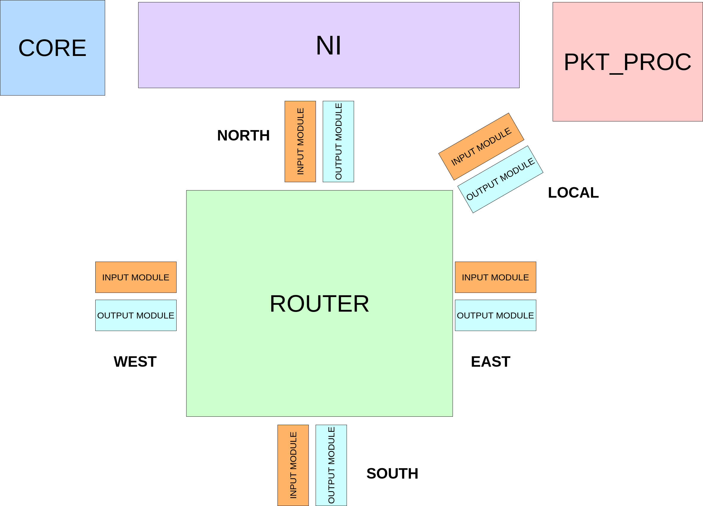
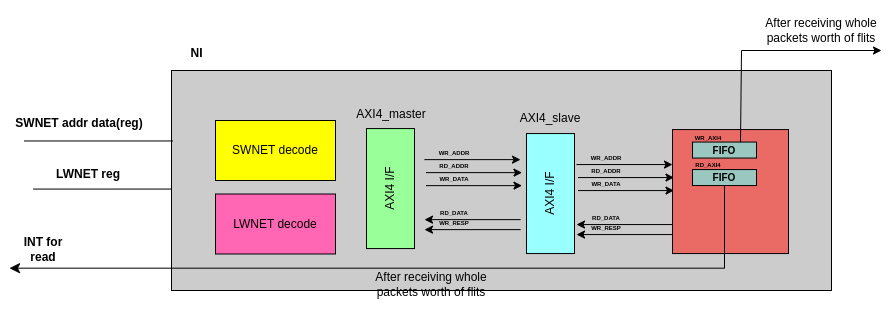
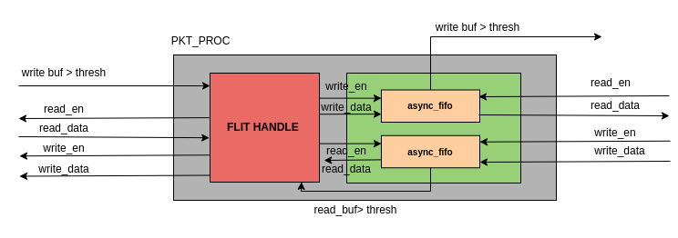
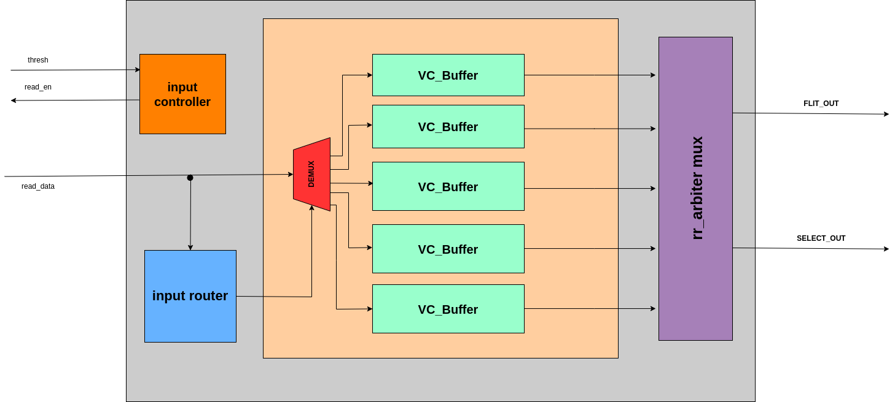
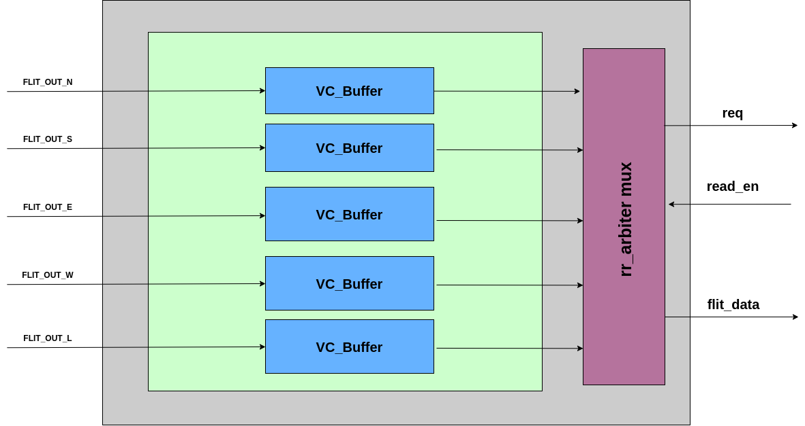
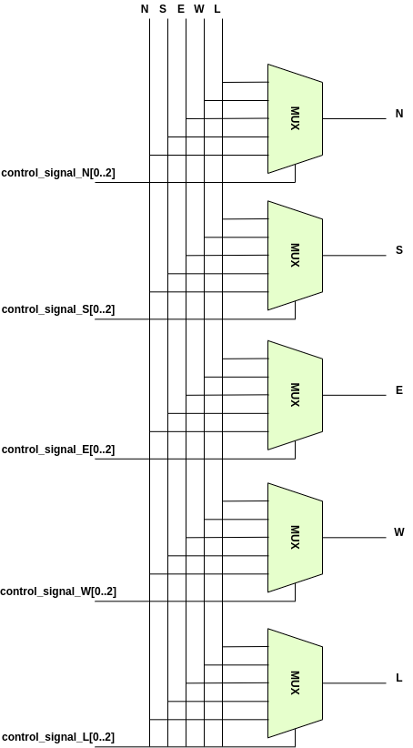
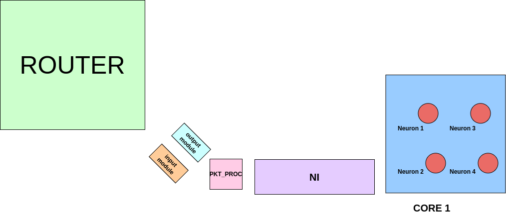
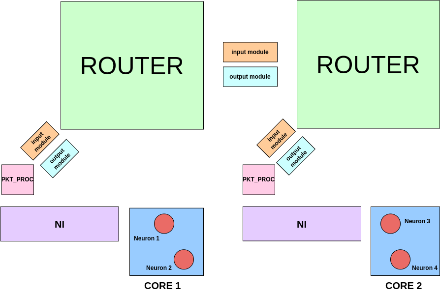
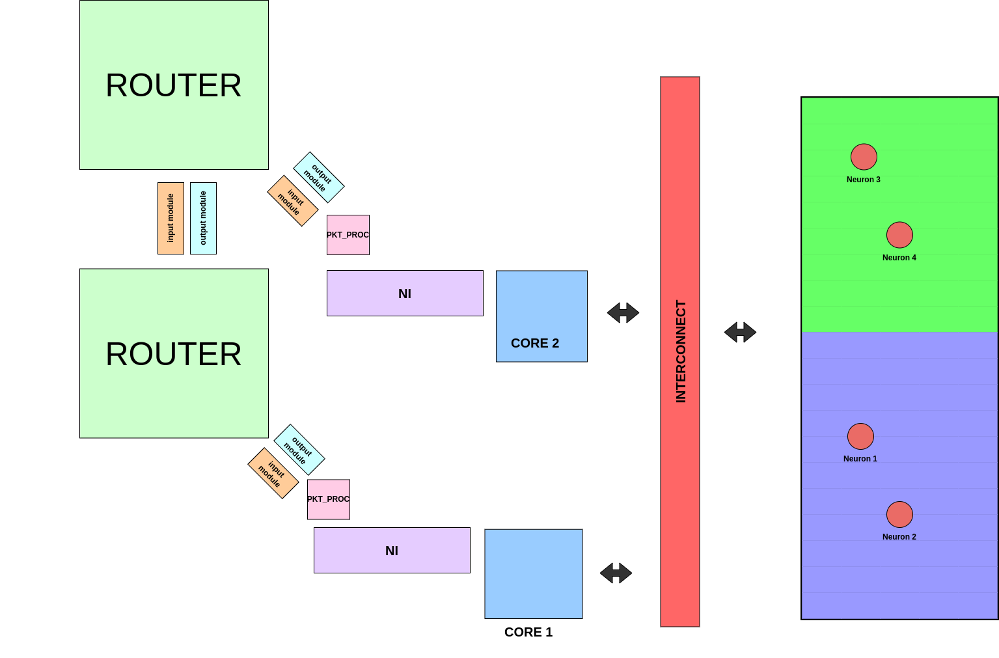

[comment]: # "This is the standard layout for the project, but you can clean this and use your own template"

# Neuromorphic Network-on-Chip Architecture for Spiking Neural Networks

#### Team

- E/17/018, Balasuriya I.S., [email](mailto:e17018@eng.pdn.ac.lk)
- E/17/154, Karunanayake A.I. , [email](mailto:e17154@eng.pdn.ac.lk)
- E/17/286, Rathnayaka R.M.T.N.K., [email](mailto:e17286@eng.pdn.ac.lk)

#### Supervisors

- Dr. Isuru Nawinne, [email](mailto:isurunawinne@eng.pdn.ac.lk)
- Dr. Mahanama Wickramasinghe, [email](mailto:mahanamaw@eng.pdn.ac.lk)
- Prof. Roshan Ragel, [email](mailto:roshanr@eng.pdn.ac.lk)
- Dr. Isuru Dasanayake, [email](mailto:isurud@ee.pdn.ac.lk)

#### Table of content

1. [Abstract](#abstract)
2. [Related works](#related-works)
3. [Methodology](#methodology)
4. [Experiment Setup and Implementation](#experiment-setup-and-implementation)
5. [Results and Analysis](#results-and-analysis)
6. [Conclusion](#conclusion)
7. [Publications](#publications)
8. [Links](#links)

---

## Abstract

Neuromorphic engineering is an interesting discipline
within computer science which endeavours to emulate the in-
tricate functioning of the human brain through the utilisation of very large-scale integrated (VLSI) circuits. These architectures employ artificial neurons and synapses to replicate the characteristics of the brain, including its exceptional parallelism,rapid processing capabilities, and energy efficiency achieved by virtue of a densely interconnected neural network as well as its event-driven nature. Notably, the escalating prominence of machine learning and neural networks has rendered neuromorphic architectures increasingly relevant, surpassing
the traditional von Neumann architecture employed in most
general-purpose computers. As such, exploring the potential of neuromorphic engineering holds promise for advancing com-
putational capabilities and paving the way for novel computing paradigms.

Neuromorphic computing is an interdisciplinary subject en-
compassing multiple fields such as biology, computer science,and electronic engineering. Current research in neuromorphic engineering focuses on developing neuron models inspired by biological neurons, creating hardware implementations of artificial neurons, and designing scalable neuromorphic processor architectures. These architectures consist of numerous artificial neurons organized in a densely-connected network,
often containing a large number of interconnected processing
nodes. While these architectures differ in performance and
configuration flexibility, they are generally known for their efficiency in simulating spiking neural networks. Compared to traditional computer architectures, they offer superior performance and reduced power consumption.

Our Approach represents how a Network-on-Chip (NoC) architecture based on the RISC-V instruction set architecture (ISA) which allows for hardware-level processing of spiking neural networks, and the implementation of the design on an FPGA. RISC-V was chosen
as the base ISA since it is not only highly practical and
popular, but also completely open source and amenable to
custom extensions.

The proposed design consists of customised RISC-V processing nodes interconnected using a network interface attached to each processing node as well as a routing framework to negotiate communication between the nodes. This hardware layout is specifically employed for the purpose of simulating a spiking neural network, where each processing node is responsible for managing one or more neurons. The interconnectivity between nodes enables communication among neurons spanning across multiple nodes. Furthermore, the architecture adopts an event-driven messaging mechanism to effectively emulate the activity of the neurons.

As such, the primary objective of this research is to demon-
strate how a general purpose ISA such as RISC-V can be augmented to perform a highly-specialised task, namely the
simulation of spiking neural networks in a scalable and con-
figurable manner, whilst maintaining adherence to the original specifications of the ISA.

## Related works

### A. Spiking Neural Networks
An Artificial Neural Network (ANN) is a computing system
inspired by the biological neural networks that exist within the brain in order to solve complex tasks. An ANN is essentially a collection of artificial neurons connected together to form a network using links that imitate synapses in the brain A Spiking Neural Network (SNN) is a relatively new variety
of ANNs that more closely resembles actual biological neural
networks by incorporating the concept of time, with neurons
transmitting information during neuron spike events rather
than at each propagation cycle as is typically the case with
ANNs. Due to this inherent event-driven nature, SNNs of-
fer higher energy efficiency and a greater degree of parallelism in computations. However, it is the same event-driven nature that hinders the realisation of SNNs using general-purpose CPU and GPU hardware, and specialised hardware with native capabilities for simulating neuron spike events as well as hardware support for large-scale parallelism is required. 

This is the primary motivation for the development of neuromorphic architectures.
In the exploration of SNNs, various neuron models have
been developed, ranging from biologically plausible models
such as the Hodgkin-Huxley model to simplistic mod-
els such as the integrate-and-fire model. Biophysically
accurate models are prohibitively expensive in terms of the
computational power required and it is difficult to simulate
more than a handful of such neurons using currently available hardware. In contrast, simple models such as the integrate-
and-fire model are computationally efficient but they are too simple and not realistic enough to imitate the rich spiking
and bursting dynamics of natural neurons. Biologically-
inspired models such as the Izhikevich model and the
Fitzhugh-Nagumo model offer a compromise between
the two extremes wherein the model is complex enough to
sufficiently emulate the behaviour of natural neurons while
also being computationally effective.

### B. Neuromorphic Architecture Implementations

Given that the development of neuromorphic architectures
is an active area of research, there have been several proposed implementations with the intention of simulating and accelerating SNNs.The most prominent architecture is a massive multi-core processor network purpose-built for accelerating SNN workloads named SpiNNaker developed by the Advanced Processor Technologies Research Group (APT) at the Department of Computer Science, University of Manchester. The SpiNNaker system utilises a network of 57600 nodes with each node consisting of 18 ARM968 cores and it is being used as the neuromorphic computing platform for the Human Brain Project. It is implemented with a globally asynchronous locally synchronous (GALS) routing mechanism to allow for energy-efficient and scalable inter-node communications due to the sheer number of nodes. While SpiNNaker boasts impressively high performance and parallelism, it is an extremely expensive,
large-scale project requiring 100 kW of power from a 240 V
supply and an air-conditioned environment.
DYNAP (Dynamic Neuromorphic Asynchronous Processor), by Moradi, S. et al., is yet another neuromorphic proces-
sor architecture that boasts high scalability with heterogeneous memory structures for minimising memory utilisation. This design focuses primarily on the interconnect between the processor nodes and proposes a hierarchical routing mechanism for making the event-based communication much more efficient. DYNAPs have been demonstrated to achieve high scalability with minimal memory requirements in simulating a three-layer convolutional neural network.
Further, the OpenSpike project by Modaresi, F. et
al. and research by Zhang, J. et al. demonstrate the
utilisation of Application-Specific Integrated Circuits (ASICs) in developing neuromorphic architectures. Both implementations adopt the leaky integrate-and-fire neuron model at the hardware level along with a network implementation to provide the interconnect between the hardware neurons through event-driven updates. Such ASIC implementations of artificial
neurons offer excellent performance but lack the flexibility
in programming and configuration offered by higher-level
architectures.

Another approach to neuromorphic architectures is demon-
strated by Urgese, G. et al. in the ODIN coprocessor for
accelerating SNN workloads in Internet-of-Things (IoT) applications. The designed architecture consists of a reconfigurable neuromorphic coprocessor which interfaces with a RISC-V based System on Chip (SoC) via the Serial Peripheral Interface (SPI), allowing the RISC-V core to configure and offload SNN tasks to the ODIN coprocessor. ODIN supports the leaky integrate-and-fire model and a custom Izhikevich inspired neuron model.

The POETS (Partial Ordered Event Triggered Systems)
architecture by Shahsavari, M. et al. [15] is another ongoing research project which focuses on building a customizable hardware platform for event-driven parallel programming. The POETS system is a large parallel processing cluster where the SNN is configured using a graph schema and it is capable of simulating both the leaky integrate-and-fire neuron model as well as the Izhikevich model. Part of the POETS project is the
development of a hyperthreaded RISC-V core named Tinsel
, by Naylor, M. et al., specifically designed to work in
tandem with the POETS system to reduce latency.
Although numerous such neuromorphic architectures exist,
there is a lack of designs that exploit the programming flexibility and platform maturity of existing architectures. Granted that highly-specialised hardware as presented in existing designs deliver very high performance, the authors of this paper believe that a neuromorphic architecture based on the RISC-
V architecture, which offers greater flexibility, will yield a valuable compromise.

## Methodology

- Build RISC-V Core
- Add Custom Hardware
- Implement NoC
- Verification 
- Simulate an SNN
- Evaluate Performance

### The Core

### The NoC

#### Network Interface

#### Packet Processing

#### Input Module

#### Output Module

#### Router

### Custom Hardware - Neuron Banks

### Final Architecture

### Verification 

#### Software Simulation 

#### Hardware Testing 

## Experiment Setup and Implementation

- Sample SNN with four neurons
- Simulated on FPGA hardware
- Three different configurations used (Single Core, Two Core NoC, Two Core NoC + Neuron Banks)
- Measured clock cycles taken to execute 1s of simulation (1ms timesteps)

### Experiment I - Single Core

### Experiment II - 2 Core NoC 

### Experiment III - 2 Core Noc + Neuron Banks

## Results and Analysis

## Conclusion

## Publications
[//]: # "Note: Uncomment each once you uploaded the files to the repository"

<!-- 1. [Semester 7 report](./) -->
<!-- 2. [Semester 7 slides](./) -->
<!-- 3. [Semester 8 report](./) -->
<!-- 4. [Semester 8 slides](./) -->
<!-- 5. Author 1, Author 2 and Author 3 "Research paper title" (2021). [PDF](./). -->

## Links

[//]: # ( NOTE: EDIT THIS LINKS WITH YOUR REPO DETAILS )

- [Project Repository](https://github.com/cepdnaclk/e17-4yp-Neuromorphic-NoC-Architecture-for-SNNs)
- [Project Page](https://cepdnaclk.github.io/e17-4yp-Neuromorphic-NoC-Architecture-for-SNNs/)
- [Department of Computer Engineering](http://www.ce.pdn.ac.lk/)
- [University of Peradeniya](https://eng.pdn.ac.lk/)

[//]: # "Please refer this to learn more about Markdown syntax"
[//]: # "https://github.com/adam-p/markdown-here/wiki/Markdown-Cheatsheet"
